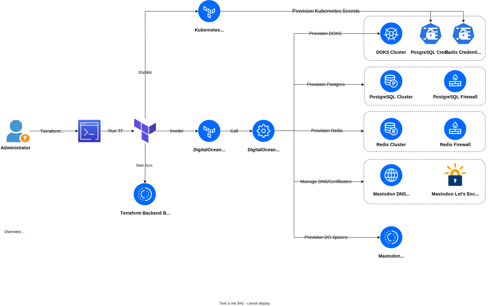

# Setting up Mastodon on DOKS using Terraform

**WORK IN PROGRESS**

## Introduction

This write up is meant to be a quick start guide for newcomers (and not only) to setup a Mastodon instance running on [DOKS](https://www.digitalocean.com/products/kubernetes) (DigitalOcean managed Kubernetes solution). It starts with a high level overview of Mastodon and all involved components. Then, you will be guided through the initial installation and configuration steps covering the infrastructure tier provisioning ([Terraform](https://www.terraform.io)), then the application tier deployment ([Helm](https://www.helm.sh)). Finally, you should be able to see your final Mastodon instance alive and kicking and also evaluate its performance under load.

**What is Mastodon?**

[Mastodon](https://docs.joinmastodon.org) is a microblogging platform similar to Twitter. It lets you create small posts (hence the microblogging terminology), follow people, react to other people posts, etc. Mastodon is an open source and actively developed project, thus it is constantly improved. The main goal is to offer people more freedom and not rely or depend on big tech companies (in contrast with what happened to Twitter lately).

From an architectural point of view, Mastodon is following a decentralized approach compared to Twitter. It means, everyone can run their Mastodon instance all over the world independently, and then interconnect with other instances via a [federated network](https://networkcultures.org/unlikeus/resources/articles/what-is-a-federated-network/). This approach gives more freedom because you can operate alone or in small groups, if desired. But, in the end it's all about cooperation and "spreading the word", or empowering the social media all over the globe.

At its heart, the Mastodon stack is powered by the following components:

1. A web component implemented using the Ruby on Rails framework.
2. A streaming engine implemented using NodeJS used for real time feed updates.
3. Sidekiq jobs used by the main backend to propagate data to other Mastodon instances.
4. An in-memory database (Redis) used for caching and as data storage for Mastodon Sidekiq jobs.
5. A PostgreSQL database used as main storage for all posts and media. This is basically the source of truth for the whole system.
6. An ElasticSearch engine (optionally) used to index and search for posts that you have authored, favorited, or been mentioned in.
7. S3 storage for the rest of persisted data such as media files caching.

The following high level diagram depicts the Mastodon architecture:



**What you will learn?**

First, you will discover and learn about the Mastodon Terraform configuration used in this guide. This step helps you understand the Terraform project used to provision all cloud resources required by the Mastodon application stack.

Next, you will learn how to use Terraform to provision required Mastodon infrastructure resources such as a Kubernetes cluster (DOKS), the database tier (PostgreSQL, Redis), and storage tier (S3) required by Mastodon to work properly. For the database tier you have the option to either use DigitalOcean's managed database solution, or go the Kubernetes way and deploy everything in your DOKS cluster.

Finally, you will learn how to deploy the Mastodon application stack via [Helm](https://www.helm.sh) on Kubernetes.

**Why not automate everything via Terraform including the Mastodon Helm release?**

Although Terraform can be used to automate and deploy the Mastodon Helm chart as well, this guide does not encourage this approach and uses a two step process instead. First, Terraform is used to provision required infrastructure on DigitalOcean, and then Helm to deploy the actual Mastodon application stack.

In practice, you will usually want to separate processes that change very often compared to ones that change less. The Mastodon setup presented in this guide relies on a database tier and DOKS - these parts don't change very often. The application stack (Mastodon) on the other hand is volatile, hence it's very likely to change more often due to future upgrades. In addition, you don't want to get stuck on the infra side if something goes wrong on the application side.

## Table of Contents

- [Introduction](#introduction)
- [Prerequisites](#prerequisites)
- [Step 1 - Understanding the Mastodon Terraform Project Configuration Used in this Guide](#step-1---understanding-the-mastodon-terraform-project-configuration-used-in-this-guide)
  - [Project Layout](#project-layout)
  - [Input Variables](#input-variables)
  - [Configuring DOKS Cluster Node Pools](#configuring-doks-cluster-node-pools)
  - [Picking a Solution for the Database and Storage Tier](#picking-a-solution-for-the-database-and-storage-tier)
  - [DigitalOcean Managed DNS Configuration](#digitalocean-managed-dns-configuration)
  - [Mastodon Kubernetes Namespace and Secrets Management](#mastodon-kubernetes-namespace-and-secrets-management)
- [Step 2 - Setting up a Remote Terraform Backend (S3)](#step-2---setting-up-a-remote-terraform-backend-s3)
- [Step 3 - Provisioning Mastodon Infrastructure on DigitalOcean using Terraform](#step-3---provisioning-mastodon-infrastructure-on-digitalocean-using-terraform)
- [Step 4 - Deploying Mastodon Application Stack to Kubernetes using Helm](#step-4---deploying-mastodon-application-stack-to-kubernetes-using-helm)
- [Step 5 - Testing the Mastodon Setup](#step-5---testing-the-mastodon-setup)
- [Troubleshooting](#troubleshooting)
- [Cleaning Up](#cleaning-up)
- [Summary](#summary)
- [Additional Resources](#additional-resources)

## Prerequisites

To complete this guide you will need:

1. [Terraform CLI](https://developer.hashicorp.com/terraform/downloads) installed on your machine, and at least some basic knowledge about [how to use the tool and main concepts](https://developer.hashicorp.com/terraform/intro). You also need your [DigitalOcean access token](https://docs.digitalocean.com/reference/api/create-personal-access-token/) at hand.
2. [Helm](https://www.helm.sh) (version 3.x is required), to install the Bitnami Mastodon chart.
3. [Doctl](https://docs.digitalocean.com/reference/doctl/how-to/install) installed and configured to interact with DigitalOcean services.
4. [Kubectl](https://kubernetes.io/docs/tasks/tools) CLI, to interact with Kubernetes clusters. Make sure it is configured to point to your DOKS cluster, as explained [here](https://docs.digitalocean.com/products/kubernetes/how-to/connect-to-cluster/).
5. A valid domain available and configured to point to DigitalOcean name servers. More information is available in this [article](https://www.digitalocean.com/community/tutorials/how-to-point-to-digitalocean-nameservers-from-common-domain-registrars). DigitalOcean is not a domain registrar, so you will need to purchase the domain from a well known vendor (such as [GoDaddy](https://www.godaddy.com), [Google](https://domains.google), etc).

## Step 1 - Understanding the Mastodon Terraform Project Configuration Used in this Guide

Before starting with the actual infrastructure provisioning process, it's best to understand how the Terraform project provided in this guide is structured. You will also learn what flags (input variables) are available to control provisioning process behavior and the desired outcome.

[Terraform](https://www.terraform.io) is a very popular tool used for infra tasks automation. It works very well for all major cloud providers and [DigitalOcean](https://www.digitalocean.com) is no exception.

By using the Terraform project from this repository you will be able to:

1. Provision a [DOKS cluster](https://docs.digitalocean.com/products/kubernetes/) as the runtime platform for the whole Mastodon application stack.
2. Install and configure a DigitalOcean managed PostgreSQL cluster (optional feature but recommended). In addition, connection pooling (for performance reasons), and a database firewall is created as well for enhanced security.
3. Install and configure a DigitalOcean managed Redis cluster (optional feature). In addition, a database firewall is created as well for enhanced security.
4. Install and configure a [DO Spaces](https://docs.digitalocean.com/products/spaces/) bucket (S3) for Mastodon media caching. Although this configuration is optional, it's highly recommended.

The following diagram shows the Terraform flow used to deploying the whole Mastodon infrastructure from this guide:



A designated person (a superuser or administrator) with high privileges provisions and manages the infrastructure via Terraform. In addition, all infra changes are tracked via the Terraform state file stored in a dedicated S3 bucket.

Next, the Mastodon Terraform project layout is introduced along with relevant bits of information.

### Project Layout

Each infrastructure resource provisioned by the Mastodon Terraform project is managed via a dedicated configuration file. This approach ensures a good and uniform layout for the whole project. Naming convention is important as well.

The Mastodon Terraform project layout is depicted below:

```text
assets/terraform/
├── do-managed-postgres.tf
├── do-managed-redis.tf
├── doks.tf
├── domain.tf
├── k8s-config.tf
├── outputs.tf
├── providers.tf
├── s3.tf
└── variables.tf
```

Each Terraform configuration file is responsible with a single task:

- [do-managed-postgres.tf](assets/terraform/do-managed-postgres.tf) - provisions a DigitalOcean managed PostgreSQL cluster, [PgBouncer](https://www.pgbouncer.org) for connection pooling, and a dedicated firewall for enhanced security.
- [do-managed-redis.tf](assets/terraform/do-managed-redis.tf) - provisions a DigitalOcean managed Redis cluster, and a dedicated firewall for enhanced security.
- [doks.tf](assets/terraform/doks.tf) - provisions a DigitalOcean Kubernetes cluster. Node pools are configurable as well.
- [domain.tf](assets/terraform/domain.tf) - manage a domain you own via DigitalOcean. This is required to expose Mastodon publicly.
- [k8s-config.tf](assets/terraform/k8s-config.tf) - defines Kubernetes resources (objects) to manage via Terraform.
- [s3.tf](assets/terraform/s3.tf) - provisions a S3 bucket (DigitalOcean Spaces) for additional storage required by Mastodon.
- [providers.tf](assets/terraform/providers.tf) - defines all providers required by the Terraform project used in this guide.
- [outputs.tf](assets/terraform/outputs.tf) - defines all outputs exported by the Terraform project used in this guide.
- [variables.tf](assets/terraform/variables.tf) - defines all input variables required by the Terraform project used in this guide. Main Terraform project behavior is controlled via this file, hence it is discussed in more detail in the next section.

The Terraform project used in this guide relies heavily on input variables to control various aspects of the final infrastructure being provisioned. Next, you will discover what options are available and how to tune each setting based on your requirements.

### Input Variables

All project settings are configured via the [variables.tf](assets/terraform/variables.tf) file. Input variables are grouped based on scope and each section is tagged accordingly. Following snippet lists all input variables used to define desired Kubernetes cluster configuration:

```json
# ===================== DOKS CONFIG VARS ======================= #

variable "doks_cluster_name_prefix" {
  type        = string
  default     = "mastodon-k8s"
  description = "DOKS cluster name prefix value (a random suffix is appended automatically)"
}

variable "doks_k8s_version" {
  type        = string
  default     = "1.25"
  description = "DOKS Kubernetes version"
}

variable "doks_cluster_region" {
  type        = string
  default     = "nyc1"
  description = "DOKS region name"
}

variable "doks_primary_node_pool" {
  type = map
  default = {
    name       = "mastodon-default"
    node_count = 2
    size       = "s-2vcpu-4gb"
  }
  description = "DOKS cluster primary node pool configuration"
}

variable "doks_additional_node_pools" {
  type = map
  default = {}
  description = "DOKS cluster additional node pool configuration"
}
```

Terraform best practices are enforced all over the place as much as possible. Each variable has a description field explaining its purpose along with a default value where the case.

The values provided as a reference may not be a good fit in all cases hence you will want to override input variables according to your requirements. Instead of tweaking each variable (not so pleasant when dealing with many values), you provide a `.tfvars` file containing all desired input values. A sample [mastodon.tfvars](./mastodon.tfvars.sample) file is provided in this repository as a reference to get you started quickly.

Next, some important aspects are detailed depending on how you want to leverage the capabilities of the Terraform project provided in this guide.

### Configuring DOKS Cluster Node Pools

Given the fact that Mastodon uses many backend components under the hood (web, sidekiq, streaming), it makes sense to provide some flexibility on the Terraform side as well. A granular setup is possible allowing you to provision a dedicated node pool for each Mastodon backend component.

**Why use such a granular setup?**

You may want to spread the load created by each Mastodon backend component. On the other hand, if you opt for an in-Kubernetes database and storage tier then provisioning dedicated node pools really matters. All workloads running in your Kubernetes cluster share the same CPU and RAM resources. Also, network and storage bandwidth is limited.

Below example shows how to setup dedicated node pools for DOKS via the `doks_additional_node_pools` Terraform input variable:

```json
# Create additional DOKS node pools 
# Dedicated node pools are useful to spread the load 
#  created by each component, such as: web, streaming or sideqkiq (OPTIONAL)

doks_additional_node_pools = {
  "mastodon-web" = {
    node_count = 1
    size       = "s-2vcpu-4gb"
  },
  "mastodon-streaming" = {
    node_count = 1
    size       = "s-2vcpu-4gb"
  },
  "mastodon-sidekiq" = {
    node_count = 1
    size       = "s-2vcpu-4gb"
  }
}
```

After applying above configuration, a DOKS cluster with three additional node pools is created and labeled accordingly: `mastodon-web`, `mastodon-streaming`, and `mastodon-sidekiq`. Each node pool hosts a specific Mastodon backend component based on the naming convention. The same approach can be used for the database tier as well if you decide to use Kubernetes as the hosting platform.

**How do you tell Kubernetes to schedule workloads on a dedicated node pool?**

This step is accomplished by configuring specific settings in the Mastodon Helm chart values file. Next, some examples are provided which describe how to configure your Mastodon Helm chart to schedule workloads on specific nodes based on labeling:

1. Scheduling the **Mastodon Web** component Pods on a dedicated node pool (assumes the node pool was tagged using `mastodon-web`):

    ```yaml
    web:
      nodeAffinityPreset:
        type: "hard"
        key: "doks.digitalocean.com/node-pool"
        values:
          - "mastodon-web"
    ```

2. Scheduling the **Mastodon Sidekiq** component Pods on a dedicated node pool (assumes the node pool was tagged using `mastodon-sidekiq`):

    ```yaml
    sidekiq:
      nodeAffinityPreset:
        type: "hard"
        key: "doks.digitalocean.com/node-pool"
        values:
          - "mastodon-sidekiq"
    ```

Above examples rely on [node affinity](https://kubernetes.io/docs/concepts/scheduling-eviction/assign-pod-node/#node-affinity) via a **hard** rule. Using this approach, Kubernetes must schedule specified workloads on target nodes. In practice it may fail to do so hence the respective application component Pods may not start and stay in an "unscheduled" state. If you use a **soft** rule on the other hand, the Kubernetes engine will try to schedule the Pods no matter what (it will pick other nodes available).

Next, you will discover how Terraform provisions the database and storage tier based on your requirements.  

### Picking a Solution for the Database and Storage Tier

The Terraform project provided in this repository is designed with flexibility in mind hence you are free to use what option fits best for your final setup: DigitalOcean managed database, or an in-Kubernetes solution.

Each solution is detailed below with pros and cons:

1. Deploy the database and storage tier as standalone Kubernetes applications right in your DOKS cluster. Maybe cheaper compared to a managed database solution. This is a Kubernetes native approach, and you also have full control over the process. The downside is that you need to take care of other processes such as database backups, deal with K8S persistent volumes (PVs) sizing, speed and bandwidth optimization, etc. Also, **connection pooling is not available in this configuration**, hence you need to set up this feature separately. Another aspect to consider and keep in mind is CPU and RAM resources consumed by the database and storage tier in addition to Mastodon application components (web, sidekiq, streaming, etc.)
2. Pick the DigitalOcean managed database solution and Spaces. At a slightly additional cost, you will have the database tier up and running in no time. Moreover, you will also get for free a firewall configured for all databases so that only your Kubernetes cluster has access. Connection pooling is available as well via [PgBouncer](https://www.pgbouncer.org). Other advantages worth mentioning are high availability, replication and automated backups.

The following input variables instruct Terraform how to provision the DigitalOcean managed database tier (hence the `external` prefix):

- `enable_external_postgresql` - tells Terraform wether it should provision a managed PostgreSQL cluster or not.
- `enable_external_redis` - tells Terraform wether it should provision a managed Redis cluster or not.

Besides above flags, you also have the possibility to configure additional details for each database cluster such as region, size, node count, engine version, and connection pooling (PostgreSQL only).

Same applies to S3 storage. You have the option to either go the Kubernetes way and deploy [MinIO](https://min.io), or use [DigitalOcean Spaces](https://www.digitalocean.com/products/spaces). The latter is more flexible of course at a very reasonable price. You don't need to worry about running out of space or figure out persistent volumes sizing in Kubernetes.

The `enable_external_s3` input variable controls the provisioning of a DigitalOcean Spaces bucket for Mastodon media files. If disabled, you need to rely on the MinIO implementation provided by the Bitnami Mastodon Helm chart.

### DigitalOcean Managed DNS Configuration

The Mastodon Terraform project used in this guide is designed to take care of domain management as well. Just point the `mastodon_web_domain` input variable to a domain that you own and start managing your DNS within your DigitalOcean account for free. This step is required in order to be able to integrate with other DigitalOcean services such as load balancers, Spaces, and to streamline automatic SSL certificate management.

A Let's Encrypt certificate is also provisioned for your Mastodon web domain. Main purpose is to enable TLS termination for DigitalOcean load balancers and Spaces (optional).

### Mastodon Kubernetes Namespace and Secrets Management

Secrets management is a painful topic in general. Unfortunately, DigitalOcean doesn't provide a secrets management solution out of the box. An interim solution is provided where Terraform is used to create and manage the Kubernetes namespace and secrets for the Mastodon application to access DigitalOcean managed database.

**Wait, wouldn't this create a tight coupling between infrastructure and application management via Helm?**

Yes and no. Whenever you provision the DigitalOcean managed database tier via Terraform, an access password is automatically created for you by the service. In the future, if you re-create the database tier, passwords might change. Next, it makes sense to let Terraform manage the Kubernetes secrets containing database credentials for you. Whenever you deploy or upgrade the Mastodon application stack, the process should be pretty straightforward because you're just pointing Helm to use the secrets Terraform manages automatically for you. Another benefit is that you don't need to pass sensitive data via CLI, or store credentials in the Helm values file. You just reference the Kubernetes secrets managed via Terraform.

Moving forward, Terraform is also used to manage the Kubernetes namespace for Mastodon. This works as well with no issues because you point Helm to use an existing namespace when performing Mastodon deployments or upgrades. The Mastodon application needs unrestricted access to secrets containing database credentials.

In the end, this method creates a bit of coupling between the infrastructure and application tier. On the other hand, it makes sense to delegate the task of managing Kubernetes secrets containing database credentials to Terraform. It's just a simple compromise.

## Step 2 - Setting up a Remote Terraform Backend (S3)

A [DigitalOcean Spaces](https://cloud.digitalocean.com/spaces) bucket is strongly recommended to store the Terraform state file remotely. As long as the space is private, any sensitive data present in the state file is secure. A remote state file allows collaborative work between multiple teams.

Because of the way Terraform works, you must perform this step manually. It is required only once when you initialize the Mastodon Terraform project for the first time.

Follow below steps to initialize a remote Terraform backend for the Mastodon project:

1. Create a [DigitalOcean Spaces bucket](https://docs.digitalocean.com/products/spaces/how-to/create/) first for storing the Terraform state file. Make sure that it is configured to restrict file listing for security reasons.
2. [DigitalOcean Spaces access keys](https://docs.digitalocean.com/products/spaces/how-to/manage-access/) are required next. Copy the `key` and `secret` values, and export each via environment variables (make sure to replace the `<>` placeholders):

    ```shell
    export DO_SPACES_ACCESS_KEY="<YOUR_DO_SPACES_ACCESS_KEY>"
    export DO_SPACES_SECRET_KEY="<YOUR_DO_SPACES_SECRET_KEY>"
    ```

3. Clone this repo, and change directory to `assets/terraform`:

    ```shell
    git clone https://github.com/digitalocean/mastodon-blueprint-kubernetes.git

    cd mastodon-blueprint-kubernetes/assets/terraform
    ```

4. Rename the provided [`backend.tf.sample`](assets/terraform/backend.tf.sample) file to `backend.tf`:

    ```shell
    cp backend.tf.sample backend.tf
    ```

5. Edit the `backend.tf` file and replace the `<>` placeholders with your bucket's and Terraform state file's name you want to create:

    ```text
    # Store the Terraform state file using a DigitalOcean Spaces bucket

    terraform {
      backend "s3" {
        skip_credentials_validation = true
        skip_metadata_api_check     = true
        endpoint                    = "<REGION>.digitaloceanspaces.com"  # e.g: fra1.digitaloceanspaces.com
        region                      = "us-east-1"                        # leave this as is (Terraform expects the AWS region format)
        bucket                      = "<BUCKET_NAME>"                    # replace this with your bucket name
        key                         = "<TF_STATE_FILE_NAME>"             # replaces this with your state file name (e.g. terraform.tfstate)
      }
    }
    ```

6. Initialize the Terraform backend using the DO Spaces access and secret key:

    ```shell
    terraform init  --backend-config="access_key=$DO_SPACES_ACCESS_KEY" --backend-config="secret_key=$DO_SPACES_SECRET_KEY"
    ```

    The output looks similar to the following:

    ```text
    Initializing the backend...

    Successfully configured the backend "s3"! Terraform will automatically
    use this backend unless the backend configuration changes.

    Initializing provider plugins...
    - Finding hashicorp/kubernetes versions matching "2.3.2"...
    - Finding gavinbunney/kubectl versions matching "1.11.2"...
    ...
    ```

If everything looks like above you're all set. You should also see the Terraform state file created in your S3 bucket. Next, you will discover how to provision the Mastodon infrastructure on DigitalOcean as the preferred cloud provider.

## Step 3 - Provisioning Mastodon Infrastructure on DigitalOcean using Terraform

Before proceeding with this step make sure that you read and understood the Mastodon Terraform project configuration explained at the beginning of this guide in [Step 1 - Understanding the Mastodon Terraform Project Configuration Used in this Guide](#step-1---understanding-the-mastodon-terraform-project-configuration-used-in-this-guide).

Follow below steps to get started:

1. Your [DigitalOcean personal access token](https://docs.digitalocean.com/reference/api/create-personal-access-token/) is required to access cloud services. Make sure to export the `DIGITALOCEAN_TOKEN` environment variable first:

    ```shell
    export DIGITALOCEAN_TOKEN="<YOUR_DO_ACCESS_TOKEN_HERE>"
    ```

2. Clone this repo, and change directory to `assets/terraform` (if not already):

    ```shell
    git clone https://github.com/digitalocean/mastodon-blueprint-kubernetes.git

    cd mastodon-blueprint-kubernetes/assets/terraform
    ```

3. Initialize Terraform backend:

    ```shell
    terraform init
    ```

4. Pick a sample `.tfvars` file from the [variants](assets/terraform/variants/) folder and adjust settings according to your needs using a text editor of your choice (preferably with [HCL](https://github.com/hashicorp/hcl/blob/main/hclsyntax/spec.md) linting support). For example, you can use [VS Code](https://code.visualstudio.com) (pick only one option, depending on the desired setup):

    - **Kubernetes as the hosting platform for database and storage Tier:**

      ```shell
      code variants/mastodon-default-dbs-setup.tfvars
      ```

    - **DigitalOcean managed database and storage tier:**

      ```shell
      code variants/mastodon-external-dbs-setup.tfvars
      ```

5. Use `terraform plan` to preview infra changes (pick only one option, depending on the desired setup):

    - **Kubernetes as the hosting platform for database and storage tier:**

      ```shell
      terraform plan \
        -var-file="variants/mastodon-default-dbs-setup.tfvars" \
        -out tf-mastodon-default-dbs-setup.out
      ```

    - **DigitalOcean managed database and storage tier:**

      ```shell
      terraform plan \
        -var-file="variants/mastodon-external-dbs-setup.tfvars" \
        -out tf-mastodon-external-dbs-setup.out
      ```

6. Finally, if you're OK with the infra plan, run `terraform apply` (pick only one option, depending on the desired setup):

    - **Kubernetes as the hosting platform for database and storage tier:**

      ```shell
      terraform apply "tf-mastodon-default-dbs-setup.out"
      ```

    - **DigitalOcean managed database and storage tier:**

      ```shell
      terraform apply "tf-mastodon-external-dbs-setup.out"
      ```

If everything goes as planned, all Mastodon infrastructure components should be provisioned and configured based on your choice. Next, check each infrastructure resource in turn:

1. List DOKS cluster - should print your Mastodon Kubernetes cluster status and configuration:

    ```shell
    doctl k8s cluster list
    ```

2. List managed databases (if you opted for this feature) - should print all database clusters status and configuration:

    ```shell
    doctl databases list
    ```

3. List domains managed via DigitalOcean:

    ```shell
    doctl compute domain list
    ```

4. List SSL certificates (Let's Encrypt) for your domain:

    ```shell
    doctl compute certificate list
    ```

Also, you should see the Mastodon S3 bucket created in the DigitalOcean web panel if you opted for this feature.

Finally, check if Mastodon Kubernetes namespace and secrets are present (don't forget to set kubectl context to point to your Mastodon DOKS cluster first):

1. List all Kubernetes namespaces - you should see your Mastodon namespace present in the output:

    ```shell
    kubectl get ns
    ```

2. Check the provisioned Kubernetes secrets containing database credentials from your Mastodon namespace (make sure to replace the `<>` placeholders accordingly):

    ```shell
    MASTODON_K8S_NAMESPACE="$(terraform output mastodon_k8s_namespace)"

    kubectl get secrets -n "$MASTODON_K8S_NAMESPACE"
    ```

**Hints:**

- Verify if the provisioned Kubernetes secrets contain the correct database credentials (below example requires the `base64` command installed on your system - on MacOS you can install it via `brew install base64`):

  - For **PostgreSQL**:

      ```shell
      MASTODON_K8S_NAMESPACE="$(terraform output mastodon_k8s_namespace)"
      MASTODON_PGSQL_SECRET="$(terraform -chdir=assets/terraform output pgsql_auth_secret_name)"

      kubectl get secret "$MASTODON_PGSQL_SECRET" \
        -n "$MASTODON_K8S_NAMESPACE" \
        -o jsonpath="{.data.db-password}" | base64 -d
      ```

  - For **Redis**:

      ```shell
      MASTODON_K8S_NAMESPACE="$(terraform output mastodon_k8s_namespace)"
      MASTODON_REDIS_SECRET="$(terraform -chdir=assets/terraform output redis_auth_secret_name)"

      kubectl get secret "$MASTODON_REDIS_SECRET" \
        -n "$MASTODON_K8S_NAMESPACE" \
        -o jsonpath="{.data.db-password}" | base64 -d
      ```

- Some of the required values for kubectl commands are computed via `terraform outputs`. The terraform project from this guide exposes several outputs which you can use to automate various steps in the CLI. For example, `terraform output mastodon_k8s_namespace` prints the Kubernetes namespace you used for Mastodon. Check the [outputs.tf](assets/terraform/outputs.tf) file for more information.

Next, you will learn how to configure and deploy Mastodon in your DOKS cluster via Helm CLI.

## Step 4 - Deploying Mastodon Application Stack to Kubernetes using Helm

Follow below steps to deploy Mastodon on your DOKS cluster via Helm:

1. First, clone the `mastodon-blueprint-kubernetes` repository, and change directory to your local copy (if not already):

    ```shell
    git clone https://github.com/digitalocean/mastodon-blueprint-kubernetes.git

    cd mastodon-blueprint-kubernetes
    ```

2. Next, add the Bitnami Helm repo, and list the `mastodon` chart:

    ```shell
    helm repo add bitnami https://charts.bitnami.com/bitnami

    helm repo update bitnami

    helm search repo bitnami | grep mastodon
    ```

    The output looks similar to the following:

    ```text
    NAME                            CHART VERSION   APP VERSION     DESCRIPTION
    bitnami/mastodon                0.1.2           4.0.2           Mastodon is self-hosted social network server
    ```

    **Note:**

    The chart of interest is `bitnami/mastodon`, which will install Mastodon on the cluster. Please visit the [bitnami/mastodon](https://github.com/bitnami/charts/tree/main/bitnami/mastodon/) page, for more details about this chart.

3. Now, pick a sample Helm values file from the [manifests](assets/manifests/) folder and adjust settings according to your needs using a text editor of your choice (preferably with `YAML` lint support). For example, you can use [VS Code](https://code.visualstudio.com). Please pick only one option, depending on the desired setup:

    - **Kubernetes as the hosting platform for database and storage tier:**

      ```shell
      MASTODON_HELM_CHART_VERSION="0.1.2"

      code "assets/manifests/mastodon-default-dbs-setup-v${MASTODON_HELM_CHART_VERSION}.yaml"
      ```

    - **DigitalOcean managed database and storage tier:**

      ```shell
      MASTODON_HELM_CHART_VERSION="0.1.2"

      code "assets/manifests/mastodon-external-dbs-setup-v${MASTODON_HELM_CHART_VERSION}.yaml"
      ```

4. Save the corresponding Helm values file (depending on your setup), and install Mastodon via Helm CLI (pick only one option):

    - **Kubernetes as the hosting platform for database and storage tier:**

      ```shell
      MASTODON_HELM_CHART_VERSION="0.1.2"
      MASTODON_K8S_NAMESPACE="$(terraform -chdir=assets/terraform output mastodon_k8s_namespace)"

      helm install mastodon bitnami/mastodon \
        --version "$MASTODON_HELM_CHART_VERSION" \
        --namespace  "$MASTODON_K8S_NAMESPACE" \
        --timeout 10m0s \
        -f "assets/manifests/mastodon-default-dbs-setup-v${MASTODON_HELM_CHART_VERSION}.yaml"
      ```

    - **DigitalOcean managed database and storage tier:**

      ```shell
      MASTODON_HELM_CHART_VERSION="0.1.2"
      MASTODON_K8S_NAMESPACE="$(terraform -chdir=assets/terraform output mastodon_k8s_namespace)"
      MASTODON_PGSQL_HOST="$(terraform -chdir=assets/terraform output pgsql_db_host)"
      MASTODON_PGSQL_PORT="$(terraform -chdir=assets/terraform output pgsql_db_port)"
      MASTODON_PGSQL_DB="$(terraform -chdir=assets/terraform output pgsql_db_name)"
      MASTODON_PGSQL_SECRET="$(terraform -chdir=assets/terraform output pgsql_auth_secret_name)"
      MASTODON_PGSQL_SECRET_KEY="$(terraform -chdir=assets/terraform output pgsql_auth_secret_key)"
      MASTODON_REDIS_SECRET="$(terraform -chdir=assets/terraform output redis_auth_secret_name)"
      MASTODON_REDIS_SECRET_KEY="$(terraform -chdir=assets/terraform output redis_auth_secret_key)"
      MASTODON_S3_BUCKET="$(terraform -chdir=assets/terraform output s3_bucket_name)"
      MASTODON_S3_BUCKET_REGION="$(terraform -chdir=assets/terraform output s3_bucket_region)"
      MASTODON_S3_HOST="$(terraform -chdir=assets/terraform output s3_bucket_endpoint)"

      helm install mastodon bitnami/mastodon \
        --version "$MASTODON_HELM_CHART_VERSION" \
        --namespace "$MASTODON_K8S_NAMESPACE" \
        --timeout 10m0s \
        --set externalDatabase.host="$MASTODON_PGSQL_HOST" \
        --set externalDatabase.port="$MASTODON_PGSQL_PORT" \
        --set externalDatabase.database="$MASTODON_PGSQL_DATABASE" \
        --set externalDatabase.existingSecret="$MASTODON_PGSQL_SECRET" \
        --set externalDatabase.existingSecretPasswordKey="$MASTODON_PGSQL_SECRET_KEY" \
        --set externalRedis.host="$MASTODON_REDIS_HOST" \
        --set externalRedis.port="$MASTODON_REDIS_PORT" \
        --set externalRedis.existingSecret="$MASTODON_REDIS_SECRET" \
        --set externalRedis.existingSecretPasswordKey="$MASTODON_REDIS_SECRET_KEY" \
        --set externalS3.host="$MASTODON_S3_HOST" \
        --set externalS3.bucket="$MASTODON_S3_BUCKET" \
        --set externalS3.region="$MASTODON_S3_BUCKET_REGION" \
        -f "assets/manifests/mastodon-external-dbs-setup-v${MASTODON_HELM_CHART_VERSION}.yaml"
      ```

    **Notes:**

    - A specific version for the mastodon Helm chart is used. In this case `0.1.2` is picked which corresponds to Mastodon application version number `4.0.2` (see the output from `Step 2.`). It’s good practice in general to lock on a specific version. This helps to have predictable results and allows versioning control via Git.
    - Some of the required values for Helm are computed via `terraform outputs`. The terraform project from this guide exposes several outputs which you can use to automate various steps in the CLI. For example, `terraform output mastodon_k8s_namespace` prints the Kubernetes namespace you used for Mastodon. Check the [outputs.tf](assets/terraform/outputs.tf) file for more information.
    - The `-chdir=assets/terraform` flag is used in the `terraform output` commands to instruct Terraform to change directory to `assets/terraform` first because that's where the state file is, if you followed the exact steps from this guide. Above examples assume the root directory of this project hence the `-chdir` flag requirement for terraform commands.

After a few minutes or so check all application Pods (web, sidekiq, streaming, etc.) - should be up and running (can take up to 10 minutes):

```shell
MASTODON_K8S_NAMESPACE="$(terraform -chdir=assets/terraform output mastodon_k8s_namespace)"

kubectl get pods -n "$MASTODON_K8S_NAMESPACE"
```

Finally, all application services should be up and running - a DigitalOcean load balancer should be provisioned as well with a public IP assigned:

```shell
MASTODON_K8S_NAMESPACE="$(terraform -chdir=assets/terraform output mastodon_k8s_namespace)"

kubectl get svc -n "$MASTODON_K8S_NAMESPACE"
```

```shell
doctl compute load-balancer list 
```

Next, you will check if the Mastodon instance deployed in this tutorial is working as expected.

## Step 5 - Testing the Mastodon Setup

TBD.

## Troubleshooting

TBD.

## Cleaning Up

TBD.

## Summary

TBD.

## Additional Resources

TBD.
